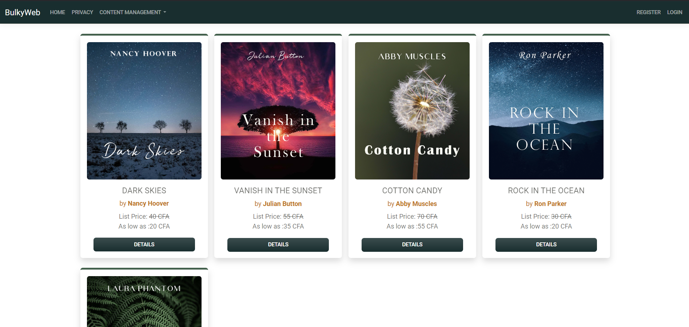
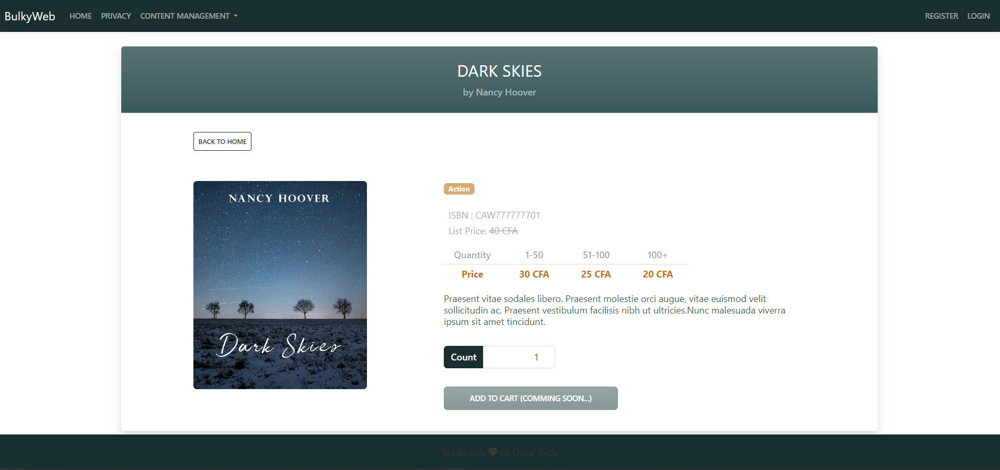
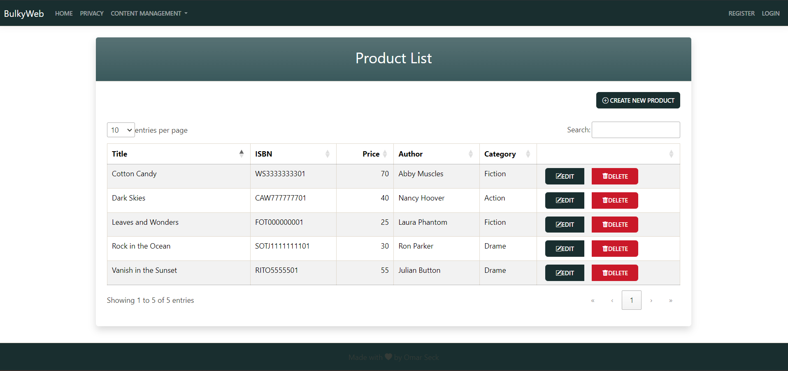

# BulkyBookWeb

BulkyBookWeb is a web application for book management, featuring an admin interface for managing books and a customer interface for browsing them. This project aims to provide a complete solution for book management and consultation.

## Features

### Admin Interface
- Add new books.
- Update existing book information.
- Delete books.
- Manage book categories and authors.

### Customer Interface
- Browse available books.
- Search books by title, author, or category.

## Technologies Used

- **Backend**:
  - .NET Core
  - C#
  - Entity Framework (EF)
  - LINQ
- **Frontend**:
  - JavaScript
  - HTML & CSS
  - Bootstrap
- **Database**:
  - Microsoft SQL Server
- **Development Environment**:
  - Microsoft Visual Studio
  - GitHub
  - Git

## Prerequisites

- [.NET SDK](https://dotnet.microsoft.com/download) version 6.0 or later.
- [Node.js](https://nodejs.org/) and npm for Angular.
- Microsoft SQL Server.
- Visual Studio 2022 or later.

## Installation

1. Clone the repository:
   ```bash
   git clone https://github.com/your-username/BulkyBookWeb.git
   cd BulkyBookWeb
   ```

2. Configure the database:
   - Ensure Microsoft SQL Server is running.
   - Update the connection string in `appsettings.json` with your database information.

3. Apply migrations to initialize the database:
   ```bash
   dotnet ef database update
   ```

4. Install Angular dependencies:
   ```bash
   cd ClientApp
   npm install
   ```

5. Run the application:
   ```bash
   cd ../
   dotnet run
   ```

6. Open your browser at: [http://localhost:5000](http://localhost:5000).

## Project Overview

Here are some screenshots to give you an overview of the project:







## Contribution

Contributions are welcome! Follow these steps:

1. Fork the repository.
2. Create a new branch:
   ```bash
   git checkout -b feature/my-new-feature
   ```
3. Make your changes and commit them:
   ```bash
   git commit -m "Add a new feature"
   ```
4. Push your changes:
   ```bash
   git push origin feature/my-new-feature
   ```
5. Open a Pull Request.

## Author

- **Omar Seck**

## License

This project is licensed under the MIT License. See the `LICENSE` file for details.
